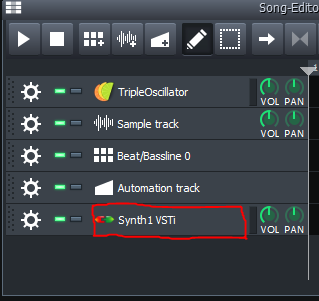
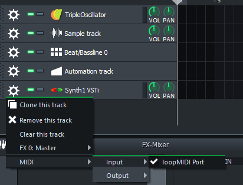

# synth1-dataset
A python toolkit to collect a dataset of sounds generated with the classic [Synth1 VST](https://daichilab.sakura.ne.jp/softsynth/index.html).

**If you are looking for the actual dataset, you can download it [here](https://www.kaggle.com/datasets/odysseask/synth1-dataset)**

This toolkit is only useful if you want to generate a new dataset using presets that you have collected yourself. 

Allows you to:
- Generate a neat CSV file with all parameters of several Synth1 presets
- Record a WAV file for each preset

# Installation

Clone the repo and run 

`pip install .`

__If you are only interested in generating a CSV of the parameters, you can skip the next steps.__

For the recording of the presets, the python code is only responsible for sending MIDI messages the the VST Host and recording the audio output.  

## DAW setup
I recommend using [LMMS](https://lmms.io/) since it's open-source and super simple to use. I have only tested this code on Windows. 

You will also need a way to route the MIDI signals for the Python process to LMMS. For this I used [LoopMidi](https://www.tobias-erichsen.de/software/loopmidi.html).

Create a new LMMS project and add a Track with the Synth1 VST



Set the MIDI input to the port created by LoopMidi.



Finally, load the midisettings.ccm in the Synth1 options. This tells Synth1 which MIDI CC to map to every parameter.


# Usage
To generate a CSV containing all of the parameters, you need to collect all your Synth1 banks in a folder. Then

```python -m synth1_dataset csv <path to banks_folder> <csv path>```


To generate a WAV file for each preset you first need to generate the CSV. Then:

```python -m synth1_dataset wav <path to csv> <output folder> --start <index to start from (default 0)>```

You can find and edit some parameters in `synth1-dataset/constants.py`:
- NOTE_DURATION: The duration of each WAV in seconds.
- SOUND_DEVICE_NAME: The name of your soundcard. You can see the available soundcards by running: `python -m synth1_dataset devices`
- SOUND_DEVICE_HOSTAPI: The hostapi parameter of your soundcard (see command above).

# Useful links

[Official Synth1 Website](https://daichilab.sakura.ne.jp/softsynth/index.html)

[Unofficial Synth1 Manual](https://sound.eti.pg.gda.pl/student/eim/doc/Synth1.pdf)
